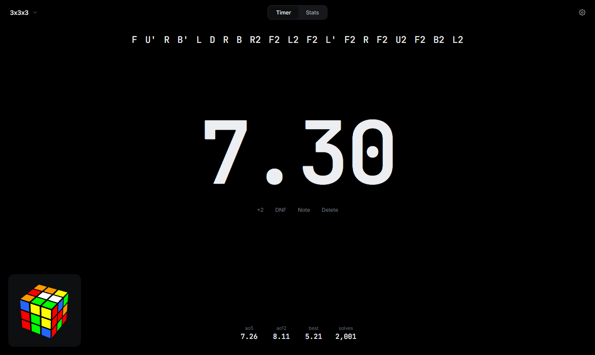
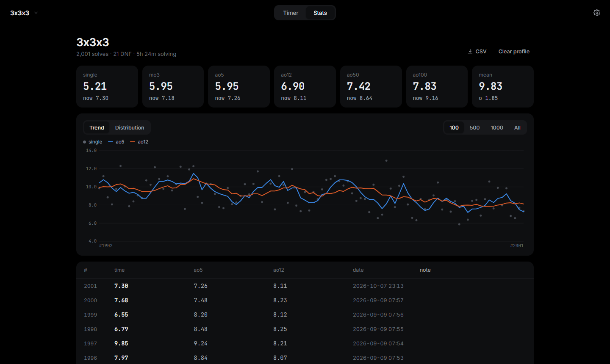
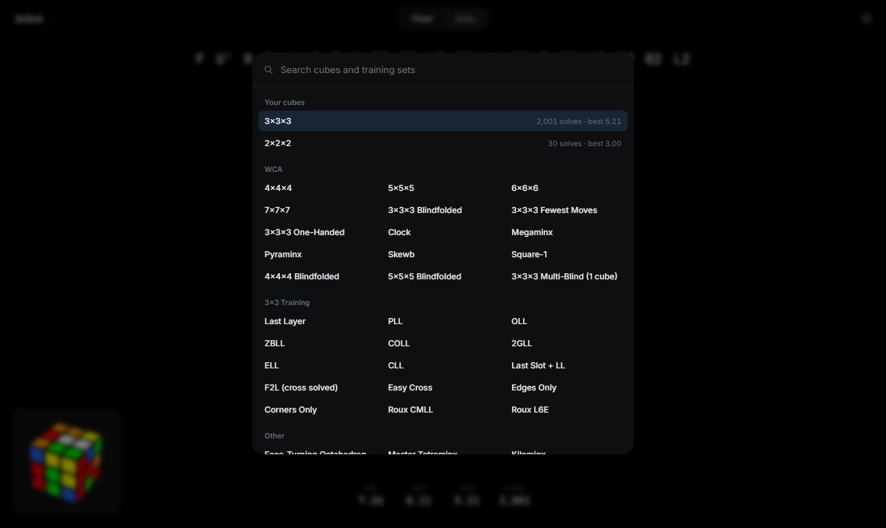
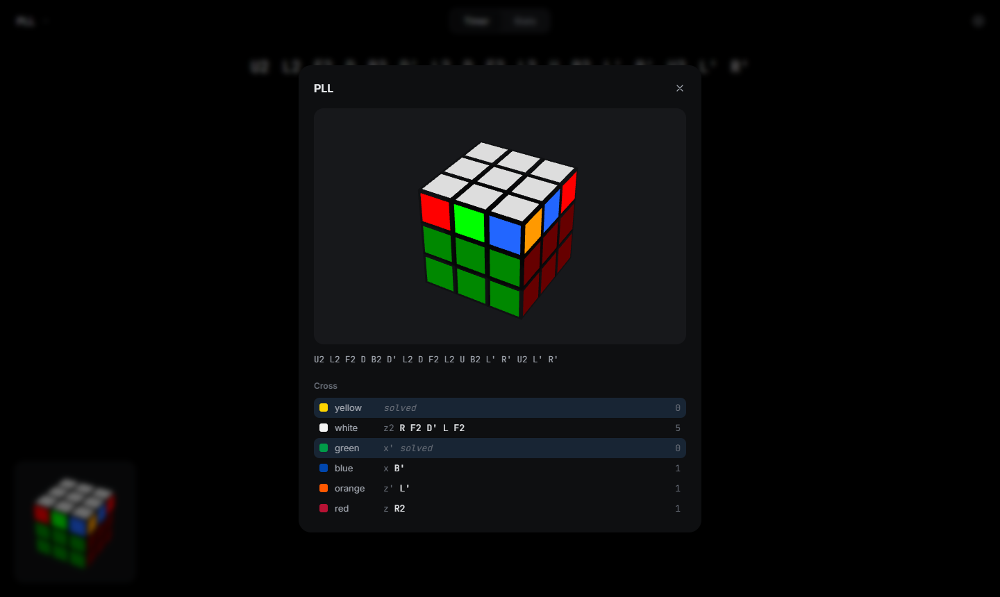

# KubeTimr

A clean speedcubing timer that does what csTimer does, with every cube getting its own profile. No accounts, nothing leaves your browser.

<table>
  <tr>
    <td align="center"><br/><em>Timer</em></td>
    <td align="center"><br/><em>Stats for the active cube</em></td>
  </tr>
  <tr>
    <td align="center"><br/><em>Every cube has its own profile</em></td>
    <td align="center"><br/><em>3D scramble with cross solutions</em></td>
  </tr>
</table>

## How it works

There are two screens, **Timer** and **Stats**, and one cube switcher.

- **Cube profiles.** 3x3, 2x2, OH, PLL training and the rest each keep their own solves, averages and records. Pick a cube with the switcher (or press `E`) and you're in that profile.
- **Timer.** Shows the scramble, the time, and one line of stats. Everything else stays hidden until you need it.
- **Stats.** Best and current for every average, a trend chart, a distribution, and the full solve table.

## Features

- Hold space or touch until green, release to start, any key stops (csTimer style)
- WCA inspection with +2 and DNF rules, plus spoken or beeped 8 and 12 second calls
- Split phases with CFOP, Roux, ZZ and BLD presets
- Typing mode for stackmat times (`1234` is 12.34)
- Random state scrambles for every WCA event, plus FTO, Kilominx, Redi Cube, relays and no scramble
- 3x3 training sets: LL, PLL, OLL, ZBLL, COLL, 2GLL, ELL, CLL, LSLL, F2L, Easy Cross, edges or corners only, Roux CMLL and L6E
- 3D scramble preview (Square-1 and Clock have no 3D model, so they show none)
- Optimal cross for all six colors in the scramble inspector
- Averages with WCA trimming (5% per side, rounded up), click any average for its breakdown
- csTimer import sorts each session into the matching cube profile and skips solves you already have
- Export to csTimer, a full KubeTimr backup, or CSV per cube
- Data from older KubeTimr versions migrates automatically
- Four themes and an accent color

## Shortcuts

| Key | Action |
|-----|--------|
| `Space` | Hold, then release to start |
| Any key | Stop the timer |
| `Esc` | Cancel inspection, close, back to timer |
| `Alt 1` `Alt 2` `Alt 3` | Last solve OK, +2, DNF |
| `Alt Z` | Delete last solve |
| `R` / `Shift R` | Next / previous scramble |
| `E` | Switch cube |
| `Alt ↑` `Alt ↓` | Cycle through cubes you use |
| `S` | Timer or stats |
| `I` | Inspection on or off |
| `F` | Fullscreen |
| `?` | All shortcuts |

## Development

```bash
npm install
npm run dev     # http://localhost:3000
npm test
npm run build
```

## Structure

```
src/
├── core/           logic with no ui, unit tested
│   ├── timer.ts    timer state machine
│   ├── stats.ts    averages, rolling series, records
│   ├── events.ts   scramble types, which are also the cube profiles
│   ├── cstimer.ts  import and export
│   ├── persistence.ts, migrate.ts
│   └── scramble/   scramble service, training subsets, cross solver
├── state/          app store and memoized stats
└── ui/             TimerScreen, StatsScreen and components
```

## License

MIT, see [LICENSE](LICENSE).
